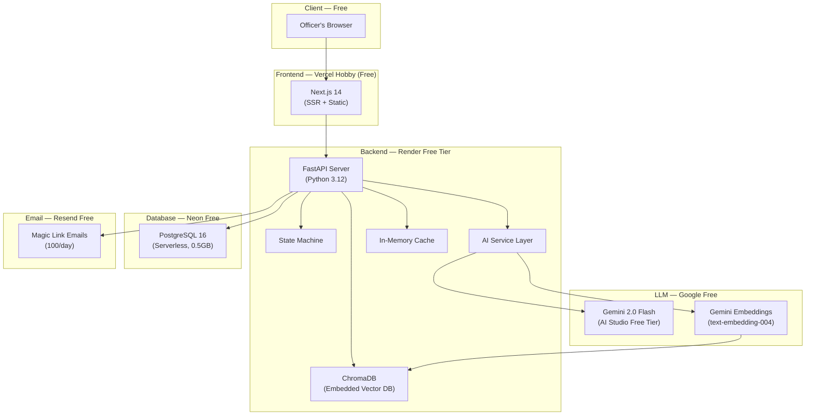

# GovernAI Studio — System Architecture (Zero-Cost Stack)
## v2.0 · May 2026

> **Design Constraint:** Total infrastructure cost = ₹0/month for MVP pilot (50-200 officers).
> Every component uses a genuinely free tier or open-source self-hosted solution.

---

## 1. Technology Stack — Free Tier Breakdown

| Layer | Technology | Free Tier Limits | Why This |
|---|---|---|---|
| **Frontend** | Next.js 14 on **Vercel Hobby** | 100GB bandwidth, serverless functions, edge CDN | Best free frontend hosting. Auto-deploys from GitHub. |
| **Backend** | Python FastAPI on **Render Free** | 750 hrs/month, spins down on idle, 512MB RAM | Zero config Docker deploy. Sleeps after 15min idle — acceptable for pilot. |
| **Database** | **Neon PostgreSQL** (free tier) | 0.5GB storage, 190 compute-hours/month, 1 project | Serverless Postgres. Scales to zero. 0.5GB is plenty for 200 officers + 21 scenarios. |
| **Vector DB** | **ChromaDB** (open source, embedded) | Unlimited — runs in-process with backend | No separate service needed. Persists to disk. Perfect for ~9K corpus chunks. |
| **LLM** | **Google Gemini 2.0 Flash** via AI Studio | **Free:** 15 RPM, 1M tokens/min, 1,500 req/day | Best free LLM tier available. Fast, capable, free. |
| **Embeddings** | **Gemini text-embedding-004** | Free: 1,500 req/day, 1M tokens/min | Same API key as LLM. Or local `all-MiniLM-L6-v2` via sentence-transformers. |
| **Auth/Email** | **Resend** free tier | 100 emails/day, 1 domain | Magic links for auth. 100/day is plenty for pilot. |
| **Cache** | **In-process LRU** (Python `cachetools`) | Unlimited — RAM only | At 50-200 users, no Redis needed. Scenario JSON cached in memory. |
| **File Storage** | **GitHub repo** + Render disk | 1GB persistent disk on Render free | Scenario JSONs committed to repo. Corpus files on disk. |
| **CI/CD** | **GitHub Actions** | 2,000 min/month free (public/private repos) | Auto-deploy on push. Run tests. |
| **Monitoring** | **Better Stack** free tier | 1 monitor, 3-day log retention | Basic uptime monitoring. |
| **Domain** | **Freenom** or Render subdomain | Free `*.onrender.com` + `*.vercel.app` | Custom domain later when budget allows. |
| **TOTAL** | | | **₹0/month** |

### Why Gemini Free Tier is the Anchor Decision

Google Gemini 2.0 Flash free tier (via AI Studio API key) provides:
- **15 requests per minute** — enough for 1-2 concurrent officers
- **1,500 requests per day** — enough for ~10-15 full scenario completions/day
- **1 million tokens per minute** — generous for streaming NPC responses
- **Quality:** Comparable to GPT-4o for roleplay, drafting critique, and reflective narrative

For a pilot of 50-200 officers completing scenarios over weeks, this is more than adequate.

**Fallback:** If Gemini rate-limits hit, queue requests with exponential backoff. Officers see "thinking..." for a few extra seconds rather than errors.

---

## 2. High-Level Architecture



### Key Architectural Differences from Paid Version

| Aspect | Paid Stack | Free Stack | Trade-off |
|---|---|---|---|
| Backend hosting | GCP Cloud Run (always-on) | Render Free (sleeps after 15min) | ~30s cold start after idle. Acceptable for pilot. |
| Database | Cloud SQL (managed) | Neon Free (serverless) | 190 compute-hrs/month limit. Scales to zero = good. |
| Vector DB | Weaviate Cloud | ChromaDB embedded | No separate service. Slightly slower but fine for 9K chunks. |
| LLM | Azure OpenAI (paid per token) | Gemini Flash (free, rate-limited) | 15 RPM limit. Queue during peak. Quality is comparable. |
| Redis cache | Managed Redis | In-process LRU dict | Lost on restart. Fine — it's just scenario cache. |
| Email | SendGrid/SES | Resend free (100/day) | Sufficient for pilot auth flows. |

---

## 3. Component Breakdown

### 3.1 Frontend (Next.js on Vercel Hobby)

**Stack:** Next.js 14 (App Router) · Tailwind CSS · shadcn/ui · Zustand

| Module | Description |
|---|---|
| Auth | Magic link flow. JWT stored in httpOnly cookie. |
| Onboarding | 2-question flow + optional Q3. Step-by-step animated cards. |
| Scenario Library | Grid of cards. Filtered server-side by tier. Domain interest recommendations. |
| Simulation UI | Setting panel, NPC chat (SSE streaming), Decision cards, Reference sidebar, Drafting editor (TipTap), Consequence display, Reflection panel. |
| Progress | Scenarios completed vs. available. No scores/leaderboards. |

**Performance targets:** Bundle < 250KB gzipped. Works on 2G. Self-hosted Inter font. No heavy assets.

### 3.2 Backend (FastAPI on Render Free)

**Stack:** Python 3.12 · FastAPI · Pydantic v2 · SQLAlchemy 2.0 · Alembic · google-genai SDK · chromadb · cachetools

```
backend/
├── app/
│   ├── main.py                    # FastAPI app + middleware
│   ├── config.py                  # Environment variables
│   ├── auth/
│   │   ├── magic_link.py          # Token generation, email sending
│   │   └── jwt.py                 # JWT creation, validation
│   ├── onboarding/
│   │   └── tier_router.py         # Rule-based tier determination
│   ├── scenarios/
│   │   ├── loader.py              # Load scenario JSON, cache in LRU
│   │   └── models.py              # Pydantic models for scenario structure
│   ├── simulation/
│   │   ├── state_machine.py       # FSM controller (8 states)
│   │   ├── session_manager.py     # CRUD, ownership enforcement
│   │   ├── npc_dialogue.py        # NPC context assembly + Gemini call
│   │   ├── reference_whisperer.py # ChromaDB query + rerank
│   │   ├── drafting_partner.py    # Draft critique via Gemini
│   │   └── reflection_coach.py    # Seven Sutras debrief via Gemini
│   ├── ai/
│   │   ├── gemini_client.py       # Gemini API wrapper with retry/backoff
│   │   └── rate_limiter.py        # Token bucket for 15 RPM limit
│   ├── db/
│   │   ├── database.py            # Neon connection (async SQLAlchemy)
│   │   ├── models.py              # ORM models
│   │   └── migrations/            # Alembic
│   ├── privacy/
│   │   └── middleware.py          # PII stripping from logs, data isolation
│   └── corpus/
│       ├── ingest.py              # PDF/text → chunks → ChromaDB
│       └── chunks/                # Pre-processed corpus chunks (JSON)
├── scenarios/                     # Scenario JSON files
├── Dockerfile
├── requirements.txt
└── render.yaml
```

### 3.3 AI Service Layer — Gemini-Powered

All five AI roles use the same `google-genai` SDK with different system prompts:

```python
# Simplified Gemini client with rate limiting
import google.generativeai as genai
from cachetools import TTLCache

class GeminiClient:
    def __init__(self):
        genai.configure(api_key=os.environ["GEMINI_API_KEY"])
        self.model = genai.GenerativeModel("gemini-2.0-flash")
        self.rate_limiter = TokenBucket(rate=15, per=60)  # 15 RPM
    
    async def generate(self, system_prompt: str, user_prompt: str, 
                       temperature: float = 0.5, stream: bool = False):
        await self.rate_limiter.acquire()
        response = self.model.generate_content(
            [system_prompt, user_prompt],
            generation_config={"temperature": temperature, "max_output_tokens": 2000},
            stream=stream
        )
        return response
```

| AI Role | Temperature | Max Tokens | Streaming | RPM Budget |
|---|---|---|---|---|
| Scenario Director | 0.4 | 1,500 | No | ~1 req/session |
| Stakeholder Roleplayers | 0.7 | 800 | Yes (SSE) | ~10-20 req/session |
| Reference Whisperer | N/A (embedding) + 0.3 (rerank) | 500 | No | ~4-6 req/session |
| Drafting Partner | 0.3 | 2,000 | No | ~1-2 req/session |
| Reflection Coach | 0.5 | 3,000 | No | ~1 req/session |
| **Total per session** | | | | **~17-30 requests** |

At 15 RPM and ~25 requests per 35-minute session, a single officer's session stays well within limits. Two concurrent officers may occasionally queue — the rate limiter adds a 2-4 second wait, shown as a "thinking..." animation.

### 3.4 ChromaDB (Embedded Vector Store)

Runs in-process with FastAPI. No separate service. Persists to Render's 1GB disk.

```python
import chromadb

# Initialize persistent ChromaDB
client = chromadb.PersistentClient(path="./chroma_data")
corpus_collection = client.get_or_create_collection(
    name="legal_corpus",
    metadata={"hnsw:space": "cosine"}
)

# Query at decision moment
def query_references(scenario_context: str, decision_prompt: str, 
                     whisperer_keywords: list, n_results: int = 5):
    query_text = f"{scenario_context} {decision_prompt} {' '.join(whisperer_keywords)}"
    results = corpus_collection.query(
        query_texts=[query_text],
        n_results=n_results,
        where={"source_type": {"$in": ["statute", "guideline", "standard"]}}
    )
    return results
```

**Corpus ingestion** happens once at deploy time (or via a management command). ~9,000 chunks embedded using Gemini's free embedding API.

---

## 4. Render Cold Start Mitigation

Render free tier spins down after 15 minutes of inactivity. Cold start takes ~30 seconds.

**Mitigations:**
1. **Health check ping:** Free cron service (cron-job.org) pings the `/health` endpoint every 14 minutes during business hours (9 AM - 10 PM IST). Keeps the server warm.
2. **Loading screen:** Frontend shows an elegant "Preparing your session..." animation during cold start.
3. **Lazy ChromaDB:** ChromaDB loads its index lazily on first query, not at startup. Reduces cold start to ~15 seconds.
4. **Pre-warm on login:** When officer logs in, frontend fires a background request to warm the backend before they navigate to a scenario.

---

## 5. Neon PostgreSQL — Staying Within Free Tier

**Limits:** 0.5GB storage · 190 compute-hours/month · 1 project · branching

**Storage Budget (estimated):**

| Table | Rows (200 officers, full usage) | Est. Size |
|---|---|---|
| users | 200 | < 1 MB |
| scenarios + NPCs + decision_moments | 21 + 100 + 70 | < 5 MB |
| sessions | ~1,000 (5 per officer) | < 2 MB |
| session_decisions | ~5,000 | < 10 MB |
| session_messages | ~20,000 | < 50 MB |
| corpus_documents (metadata only) | ~53 | < 1 MB |
| audit_logs | ~10,000 | < 5 MB |
| **Total** | | **~74 MB** (14.8% of 500MB) |

**Compute budget:** 190 hours = ~6.3 hrs/day. With Neon's auto-suspend (scales to zero when idle), this is comfortable for a pilot where officers use the platform intermittently.

---

## 6. Security (Zero-Cost)

| Control | Free Implementation |
|---|---|
| **HTTPS** | Vercel + Render provide free SSL/TLS. |
| **Auth** | Custom JWT (PyJWT). Magic links via Resend free. 15-min token expiry. |
| **Data isolation** | PostgreSQL RLS (row-level security) — built into Neon free. |
| **Secrets management** | Render + Vercel environment variables. |
| **No model training** | Gemini API (AI Studio) does not use free-tier inputs for training. Confirmed in Google's terms. |
| **PII stripping** | Custom middleware. Zero cost. |
| **Encryption at rest** | Neon encrypts at rest by default. ChromaDB data on Render's encrypted disk. |

---

## 7. Scaling Path (When Budget Arrives)

| Trigger | Upgrade | Cost |
|---|---|---|
| >2 concurrent officers hitting rate limits | Gemini paid tier ($0.10/1M input tokens) | ~$10-30/month |
| Cold starts annoying users | Render Starter ($7/month, always-on) | $7/month |
| >500MB database | Neon Launch ($19/month, 10GB) | $19/month |
| Need custom domain | Domain registration | ~$10/year |
| >200 officers | Move backend to Railway/Fly.io paid | $5-20/month |

The architecture requires **zero re-engineering** to upgrade. Every free component has a direct paid upgrade path.

---

*End of System Architecture v2.0*
