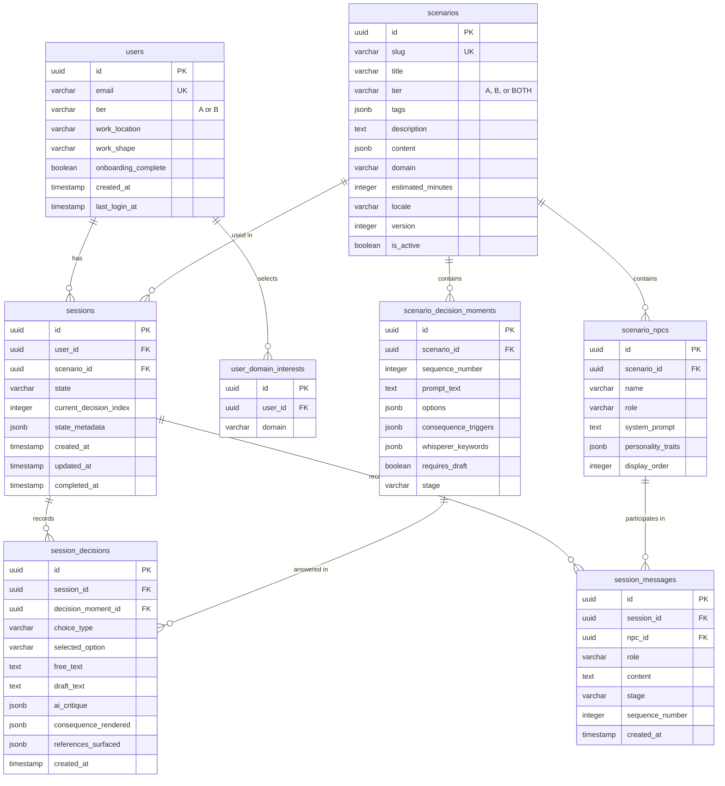

# GovernAI Studio — Database Schema (Zero-Cost Stack)
## v2.0 · May 2026

> **Database:** Neon PostgreSQL Free Tier (0.5GB storage, 190 compute-hours/month)
> **Vector DB:** ChromaDB embedded (open source, in-process, persistent to disk)

---

## 1. Entity-Relationship Diagram



---

## 2. PostgreSQL DDL

```sql
CREATE EXTENSION IF NOT EXISTS "uuid-ossp";

-- USERS (no PII beyond email)
CREATE TABLE users (
    id                  UUID PRIMARY KEY DEFAULT uuid_generate_v4(),
    email               VARCHAR(255) NOT NULL UNIQUE,
    tier                VARCHAR(1) CHECK (tier IN ('A', 'B')),
    work_location       VARCHAR(100),
    work_shape          VARCHAR(100),
    onboarding_complete BOOLEAN DEFAULT FALSE,
    created_at          TIMESTAMPTZ DEFAULT NOW(),
    last_login_at       TIMESTAMPTZ,
    is_active           BOOLEAN DEFAULT TRUE
);

CREATE TABLE user_domain_interests (
    id      UUID PRIMARY KEY DEFAULT uuid_generate_v4(),
    user_id UUID NOT NULL REFERENCES users(id) ON DELETE CASCADE,
    domain  VARCHAR(100) NOT NULL
);
CREATE INDEX idx_udi_user ON user_domain_interests(user_id);

-- SCENARIOS (content stored as JSONB)
CREATE TABLE scenarios (
    id                UUID PRIMARY KEY DEFAULT uuid_generate_v4(),
    slug              VARCHAR(100) NOT NULL UNIQUE,
    title             VARCHAR(300) NOT NULL,
    tier              VARCHAR(4) NOT NULL CHECK (tier IN ('A', 'B', 'BOTH')),
    tags              JSONB NOT NULL DEFAULT '{}',
    description       TEXT,
    content           JSONB NOT NULL,
    domain            VARCHAR(100),
    lifecycle_stage   VARCHAR(50),
    estimated_minutes INTEGER DEFAULT 35,
    locale            VARCHAR(10) DEFAULT 'en',
    version           INTEGER DEFAULT 1,
    is_active         BOOLEAN DEFAULT TRUE,
    created_at        TIMESTAMPTZ DEFAULT NOW(),
    updated_at        TIMESTAMPTZ DEFAULT NOW()
);
CREATE INDEX idx_scenarios_tier ON scenarios(tier) WHERE is_active = TRUE;
CREATE INDEX idx_scenarios_tags ON scenarios USING GIN(tags);

CREATE TABLE scenario_npcs (
    id                UUID PRIMARY KEY DEFAULT uuid_generate_v4(),
    scenario_id       UUID NOT NULL REFERENCES scenarios(id) ON DELETE CASCADE,
    name              VARCHAR(100) NOT NULL,
    role              VARCHAR(200) NOT NULL,
    system_prompt     TEXT NOT NULL,
    personality_traits JSONB DEFAULT '{}',
    display_order     INTEGER DEFAULT 0
);
CREATE INDEX idx_npcs_scenario ON scenario_npcs(scenario_id);

CREATE TABLE scenario_decision_moments (
    id                   UUID PRIMARY KEY DEFAULT uuid_generate_v4(),
    scenario_id          UUID NOT NULL REFERENCES scenarios(id) ON DELETE CASCADE,
    sequence_number      INTEGER NOT NULL,
    prompt_text          TEXT NOT NULL,
    options              JSONB NOT NULL DEFAULT '[]',
    consequence_triggers JSONB DEFAULT '{}',
    whisperer_keywords   JSONB DEFAULT '[]',
    requires_draft       BOOLEAN DEFAULT FALSE,
    stage                VARCHAR(20) NOT NULL
);
CREATE INDEX idx_dm_scenario ON scenario_decision_moments(scenario_id, sequence_number);

-- SESSIONS
CREATE TABLE sessions (
    id                     UUID PRIMARY KEY DEFAULT uuid_generate_v4(),
    user_id                UUID NOT NULL REFERENCES users(id) ON DELETE CASCADE,
    scenario_id            UUID NOT NULL REFERENCES scenarios(id),
    state                  VARCHAR(30) NOT NULL DEFAULT 'NOT_STARTED'
                           CHECK (state IN ('NOT_STARTED','SETTING','STAKEHOLDERS',
                           'DECISION_MOMENTS','CONSEQUENCES','REFLECTION','COMPLETED','ABANDONED')),
    current_decision_index INTEGER DEFAULT 0,
    state_metadata         JSONB DEFAULT '{}',
    group_id               UUID,
    created_at             TIMESTAMPTZ DEFAULT NOW(),
    updated_at             TIMESTAMPTZ DEFAULT NOW(),
    completed_at           TIMESTAMPTZ
);
CREATE INDEX idx_sessions_user ON sessions(user_id);

-- SESSION DECISIONS (private to officer)
CREATE TABLE session_decisions (
    id                  UUID PRIMARY KEY DEFAULT uuid_generate_v4(),
    session_id          UUID NOT NULL REFERENCES sessions(id) ON DELETE CASCADE,
    decision_moment_id  UUID NOT NULL REFERENCES scenario_decision_moments(id),
    choice_type         VARCHAR(10) NOT NULL CHECK (choice_type IN ('OPTION', 'FREEFORM')),
    selected_option     VARCHAR(50),
    free_text           TEXT,
    draft_text          TEXT,
    ai_critique         JSONB,
    consequence_rendered JSONB,
    references_surfaced JSONB,
    created_at          TIMESTAMPTZ DEFAULT NOW()
);
CREATE INDEX idx_sd_session ON session_decisions(session_id);

-- SESSION MESSAGES (NPC dialogues, private to officer)
CREATE TABLE session_messages (
    id              UUID PRIMARY KEY DEFAULT uuid_generate_v4(),
    session_id      UUID NOT NULL REFERENCES sessions(id) ON DELETE CASCADE,
    npc_id          UUID REFERENCES scenario_npcs(id),
    role            VARCHAR(10) NOT NULL CHECK (role IN ('officer', 'npc', 'system')),
    content         TEXT NOT NULL,
    stage           VARCHAR(20) NOT NULL,
    sequence_number INTEGER NOT NULL,
    created_at      TIMESTAMPTZ DEFAULT NOW()
);
CREATE INDEX idx_sm_session ON session_messages(session_id, sequence_number);

-- AUDIT LOGS (append-only)
CREATE TABLE audit_logs (
    id            UUID PRIMARY KEY DEFAULT uuid_generate_v4(),
    user_id       UUID REFERENCES users(id) ON DELETE SET NULL,
    action        VARCHAR(100) NOT NULL,
    resource_type VARCHAR(50),
    resource_id   UUID,
    details       JSONB DEFAULT '{}',
    created_at    TIMESTAMPTZ DEFAULT NOW()
);
CREATE INDEX idx_audit_user ON audit_logs(user_id, created_at);
CREATE RULE audit_no_update AS ON UPDATE TO audit_logs DO INSTEAD NOTHING;
CREATE RULE audit_no_delete AS ON DELETE TO audit_logs DO INSTEAD NOTHING;

-- ROW-LEVEL SECURITY
ALTER TABLE sessions ENABLE ROW LEVEL SECURITY;
ALTER TABLE session_decisions ENABLE ROW LEVEL SECURITY;
ALTER TABLE session_messages ENABLE ROW LEVEL SECURITY;

CREATE POLICY sessions_isolation ON sessions
    USING (user_id = current_setting('app.current_user_id')::uuid);
CREATE POLICY decisions_isolation ON session_decisions
    USING (session_id IN (SELECT id FROM sessions WHERE user_id = current_setting('app.current_user_id')::uuid));
CREATE POLICY messages_isolation ON session_messages
    USING (session_id IN (SELECT id FROM sessions WHERE user_id = current_setting('app.current_user_id')::uuid));
```

---

## 3. ChromaDB Schema (Vector Store)

ChromaDB runs embedded in the FastAPI process. No separate service.

```python
# Corpus ingestion script
import chromadb

client = chromadb.PersistentClient(path="./chroma_data")

collection = client.get_or_create_collection(
    name="legal_corpus",
    metadata={"hnsw:space": "cosine"}
)

# Each chunk stored with metadata for filtered search
collection.add(
    ids=["dpdp_s8_chunk_1"],
    documents=["Section 8(1): A Data Fiduciary shall..."],
    metadatas=[{
        "document_title": "Digital Personal Data Protection Act 2023",
        "source_type": "statute",
        "section_reference": "Section 8(1)",
        "year": 2023,
        "scenario_relevance": "vendor-free-ai,twelve-thousand-rejections"
    }]
)
```

**Chunking:** ~300 tokens, 50-token overlap, sentence-boundary aware.
**Estimated corpus:** ~53 source documents → ~8,900 chunks → ~50MB on disk.

**Embedding options (both free):**
1. **Gemini text-embedding-004** — free tier, 1,500 req/day. Use for initial ingestion (one-time batch).
2. **Local `all-MiniLM-L6-v2`** via sentence-transformers — runs on CPU, no API needed. Backup option.

---

## 4. Storage Budget (Neon 0.5GB Limit)

| Data | Est. Size | Notes |
|---|---|---|
| Schema + indexes | ~5 MB | Fixed |
| 21 scenario rows (JSONB content) | ~5 MB | 12 scenarios, some twinned |
| 200 users + onboarding | ~1 MB | Minimal PII |
| 1,000 sessions | ~2 MB | 5 per officer average |
| 5,000 decisions | ~10 MB | JSONB critique/references |
| 20,000 messages | ~50 MB | NPC dialogue history |
| Audit logs | ~5 MB | Append-only |
| **Total** | **~78 MB** | **15.6% of 500MB limit** |

Plenty of headroom. Even at 500 officers, we'd use ~200MB.

---

*End of Database Schema v2.0*
