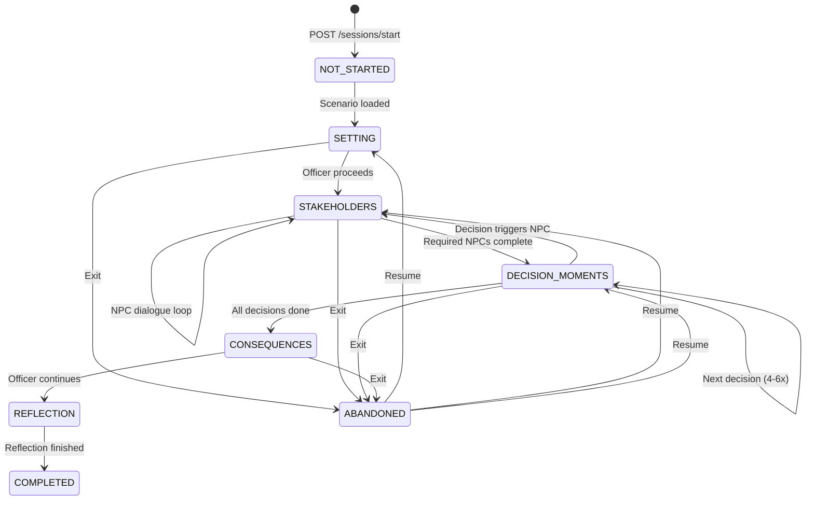

# GovernAI Studio — State Machine & User Journey
## v2.0 · May 2026

---

## 1. Simulation State Machine



## 2. State Definitions

| State | What Happens | Checkpoint? |
|---|---|---|
| `NOT_STARTED` | Session created, scenario JSON loaded from cache/DB | No |
| `SETTING` | Scenario Director adapts narrative to tier via Gemini. Officer reads scene-setter. | Yes |
| `STAKEHOLDERS` | 3-6 NPCs interact. Streaming responses. Min 1 exchange per required NPC. | Yes (per exchange) |
| `DECISION_MOMENTS` | 4-6 decisions sequentially. Options + freeform. Whisperer triggers. Draft editor if needed. | Yes (per decision) |
| `CONSEQUENCES` | Consequences rendered as headlines, RTI filings, internal notes. | Yes |
| `REFLECTION` | Reflection Coach generates Seven Sutras debrief via Gemini. | No (terminal) |
| `COMPLETED` | Session done. Officer can revisit reflection. Cannot replay. | N/A |
| `ABANDONED` | Officer exited. Resumes from last checkpoint. | Inherited |

## 3. Persistence (No Redis — In-Memory + Neon)

Since we're on Render free tier (no Redis), state is persisted to **Neon PostgreSQL only**, with an **in-process LRU cache** for fast reads:

```python
from cachetools import TTLCache

# In-memory cache (lost on Render cold restart — OK, Neon is source of truth)
session_cache = TTLCache(maxsize=200, ttl=3600)  # 200 sessions, 1hr TTL

async def get_session_state(session_id: str):
    if session_id in session_cache:
        return session_cache[session_id]
    # Cache miss → load from Neon
    state = await db.fetch_session(session_id)
    session_cache[session_id] = state
    return state

async def save_session_state(session_id: str, state: dict):
    # Write-through: update both cache and DB
    session_cache[session_id] = state
    await db.update_session(session_id, state)
```

**On Render cold restart:** Cache is empty. First request loads from Neon (~100ms). Officer doesn't notice.

## 4. Scenario JSON Format

```json
{
  "id": "vendor-free-ai-tier-a",
  "title": "The Vendor with the Free AI",
  "tier": "A",
  "twin_id": "vendor-free-ai-tier-b",
  "domain": "cross_cutting",
  "locale": "en",
  "estimated_minutes": 35,
  "tags": {
    "sutras": ["innovation_over_restraint", "trust", "accountability"],
    "pillars": ["infrastructure", "policy_regulation"],
    "lifecycle_stage": "planning_design",
    "risk_categories": ["systemic", "transparency"],
    "ai_value_chain": ["developer", "deployer"]
  },
  "setting": {
    "narrative": "It is 9:47 AM on a Tuesday in March...",
    "tier_adaptation_prompt": "Adapt for a Joint Secretary in MeitY..."
  },
  "npcs": [
    {
      "id": "npc_vendor",
      "name": "Vikram Desai",
      "role": "Vendor Solution Architect",
      "system_prompt": "You are Vikram Desai, a senior solution architect...",
      "personality_traits": { "tone": "persuasive", "pressure_level": "high" },
      "required_interactions": 2,
      "display_order": 1
    }
  ],
  "decision_moments": [
    {
      "sequence": 1,
      "prompt": "The vendor has made a compelling case...",
      "options": [
        { "id": "opt_a", "label": "Proceed with vendor", "consequence_branch": "branch_proceed" },
        { "id": "opt_b", "label": "Propose alternatives", "consequence_branch": "branch_alternatives" },
        { "id": "opt_c", "label": "Reject outright", "consequence_branch": "branch_reject" },
        { "id": "freeform", "label": "Write your own approach" }
      ],
      "whisperer_keywords": ["data residency", "GFR Rule 144", "vendor lock-in"],
      "requires_draft": false
    }
  ],
  "consequence_tree": {
    "branch_proceed": {
      "artefacts": [
        { "type": "news_headline", "content": "Ministry signs 3-year AI deal..." },
        { "type": "rti_filing", "content": "Under Section 6, I request..." }
      ],
      "narrative": "Three months later, the chatbot is live..."
    }
  },
  "reflection_mapping": {
    "trust": "How did the officer engage with citizen trust...",
    "innovation_over_restraint": "Did the officer balance urgency with due diligence...",
    "accountability": "How was responsibility distributed across the value chain..."
  }
}
```

---

## 5. User Journey (Login → Reflection)

| Step | Time | What Happens |
|---|---|---|
| **1. Visit** | 0:00 | Officer opens `governai.vercel.app`. If backend sleeping, sees "Preparing..." for ~15-30s. |
| **2. Auth** | 0:30 | Enters gov.in email → magic link → JWT issued. |
| **3. Onboarding** | 1:00 | First time only. 2 questions → tier assigned silently. Optional Q3 for domain interests. |
| **4. Browse** | 2:00 | Scenario library grid. Cards filtered by tier. Recommendations highlighted. |
| **5. Start** | 3:00 | Clicks scenario → session created → Setting narrative appears. |
| **6. Setting** | 3:00-7:00 | Reads immersive scene. Government idiom. Typewriter reveal. |
| **7. NPCs** | 7:00-22:00 | Chats with 3-6 NPCs. Streaming responses. Must engage each required NPC. |
| **8. Decisions** | 22:00-35:00 | 4-6 decision moments. Options + freeform. Whisperer sidebar (non-intrusive). Drafting editor if needed. |
| **9. Consequences** | 35:00-40:00 | Headlines, RTI filings, vendor emails play out. No right/wrong. |
| **10. Reflection** | 40:00-48:00 | Private Seven Sutras debrief. Reflective questions. Further reading. |
| **11. Complete** | 48:00 | Returns to library. Scenario marked complete. No score. |

**Total: ~45 minutes per scenario.**

---

*End of State Machine & User Journey v2.0*
