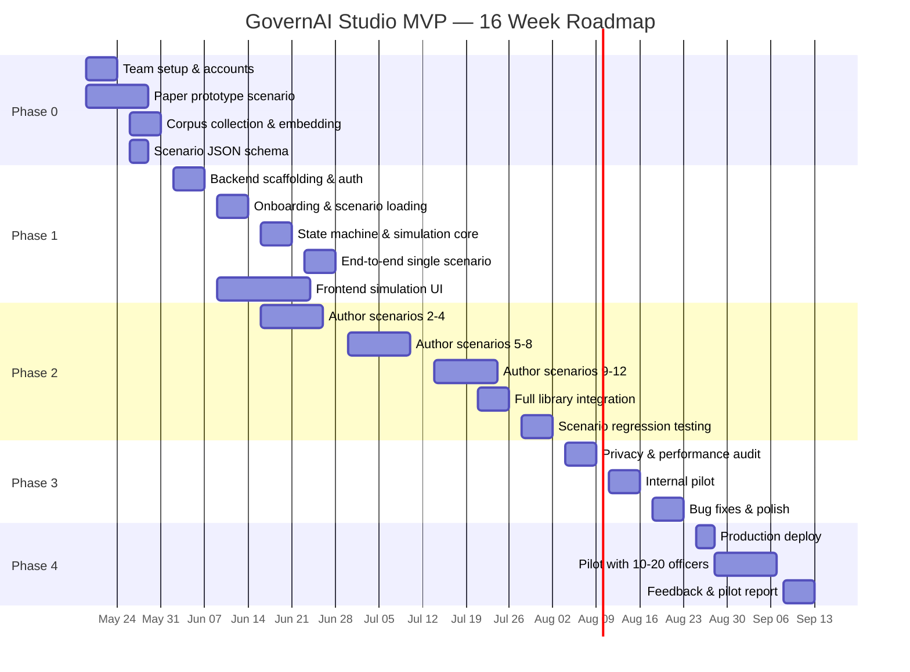

# GovernAI Studio — Development Roadmap (Zero-Cost)
## v2.0 · May 2026

> **Team:** 2-3 developers, 1 AI engineer, 1 content author, 1 product lead
> **Duration:** 16 weeks · **Budget:** ₹0 infrastructure

---

## Phase 0 — Foundation & Corpus (Weeks 1-2)

### Week 1: Setup & Design Freeze
| Task | Owner | Hours | Dependency |
|---|---|---|---|
| Freeze tech stack decisions (this document) | Product Lead | 4 | — |
| Set up GitHub monorepo (frontend + backend) | Dev 1 | 4 | — |
| Set up Neon PostgreSQL free account + run initial migration | Dev 1 | 3 | Repo ready |
| Set up Vercel Hobby account, connect repo | Dev 1 | 2 | Repo ready |
| Set up Render free account, connect repo | Dev 2 | 2 | Repo ready |
| Get Gemini API key (AI Studio, free) | AI Engineer | 1 | — |
| Set up Resend free account (magic link emails) | Dev 2 | 1 | — |
| Write paper prototype of "The Vendor with the Free AI" (both tiers) | Content Author | 16 | — |
| Design UI wireframes (Figma, free tier) | Dev 2 | 8 | — |

### Week 2: Corpus Assembly
| Task | Owner | Hours | Dependency |
|---|---|---|---|
| Collect all Reference Whisperer source documents (PDFs, texts) | Content Author + Product | 16 | — |
| Build corpus ingestion script (PDF → chunks → ChromaDB) | AI Engineer | 12 | — |
| Chunk and embed full corpus (~53 docs → ~9K chunks) using Gemini embeddings | AI Engineer | 8 | Ingestion script |
| Test ChromaDB retrieval quality with sample queries | AI Engineer | 4 | Corpus embedded |
| Convert paper prototype to scenario JSON format | Content Author | 8 | Paper prototype done |
| Design Scenario JSON schema (Pydantic models) | Dev 1 | 4 | Paper prototype done |

**Week 2 Milestone:** ✅ Corpus embedded in ChromaDB. ✅ One scenario in JSON format. ✅ All free accounts provisioned.

---

## Phase 1 — Skeleton Engine (Weeks 3-6)

### Week 3: Backend Foundation
| Task | Owner | Hours | Dependency |
|---|---|---|---|
| FastAPI project scaffolding (folder structure, config, middleware) | Dev 1 | 8 | — |
| Database ORM models (SQLAlchemy) + Alembic migrations | Dev 1 | 8 | Schema doc |
| Auth system: magic link generation, JWT issuance, token refresh | Dev 2 | 12 | Resend account |
| Gemini client wrapper with rate limiting (15 RPM token bucket) | AI Engineer | 6 | Gemini API key |
| ChromaDB integration in FastAPI (persistent client, query endpoint) | AI Engineer | 4 | Corpus ready |
| Deploy skeleton to Render free tier, verify cold start | Dev 1 | 3 | — |

### Week 4: Onboarding + Scenario Loading
| Task | Owner | Hours | Dependency |
|---|---|---|---|
| Onboarding API: questions, submit, tier determination logic | Dev 2 | 6 | Auth done |
| Scenario loader: load JSON from DB, LRU cache | Dev 1 | 4 | ORM models |
| Tier router: filter scenarios by officer tier | Dev 1 | 3 | Onboarding done |
| Seed database: insert "Vendor with Free AI" scenario (both tiers) | Dev 1 | 2 | JSON schema |
| Next.js project scaffolding (App Router, Tailwind, shadcn/ui) | Dev 2 | 6 | — |
| Auth UI: magic link login flow | Dev 2 | 6 | Backend auth |
| Onboarding UI: animated step-by-step cards | Dev 2 | 6 | Backend onboarding |

### Week 5: State Machine + Simulation Core
| Task | Owner | Hours | Dependency |
|---|---|---|---|
| State machine controller (8 states, valid transitions, persistence) | Dev 1 | 12 | ORM models |
| Session management API (start, get, list, resume) | Dev 1 | 6 | State machine |
| NPC dialogue manager (context assembly, Gemini call, streaming) | AI Engineer | 12 | Gemini client |
| Reference Whisperer service (ChromaDB query + Gemini rerank) | AI Engineer | 8 | ChromaDB integration |
| Simulation UI: Setting panel (typewriter narrative reveal) | Dev 2 | 6 | — |
| Simulation UI: Stakeholder chat (SSE streaming, NPC avatars) | Dev 2 | 10 | NPC dialogue API |

### Week 6: Complete Single-Scenario Loop
| Task | Owner | Hours | Dependency |
|---|---|---|---|
| Decision card UI (options + freeform + reference sidebar) | Dev 2 | 8 | Whisperer API |
| Decision submission API + consequence branching | Dev 1 | 6 | State machine |
| Consequence display UI (headlines, RTI, internal notes) | Dev 2 | 6 | Consequence API |
| Drafting Partner service (multi-angle critique via Gemini) | AI Engineer | 8 | Gemini client |
| Drafting editor UI (TipTap, split-view critique) | Dev 2 | 8 | Drafting API |
| Reflection Coach service (Seven Sutras debrief via Gemini) | AI Engineer | 10 | Gemini client |
| Reflection panel UI (expandable Sutra sections, further reading) | Dev 2 | 6 | Reflection API |
| **END-TO-END DEMO:** Full scenario loop with "Vendor with Free AI" | All | 4 | Everything above |

**Week 6 Milestone:** ✅ One complete scenario playable end-to-end (Setting → NPCs → Decisions → Consequences → Reflection). ✅ Deployed on Vercel + Render (free). ✅ Reference Whisperer working. ✅ Drafting Partner working.

---

## Phase 2 — Content Integration (Weeks 5-10, overlapping with Phase 1)

### Weeks 5-7: Scenario Authoring (Content Author, parallel)
| Task | Owner | Hours | Dependency |
|---|---|---|---|
| Author scenarios 2-4 in JSON format (Twelve Thousand Rejections, Seventy-Two Hours, Cameras in Market) | Content Author | 40 | JSON schema finalized |
| Write all NPC system prompts for scenarios 2-4 | Content Author + AI Eng | 20 | — |
| Author scenarios 5-8 (Reading, Anomaly, Counter-Note, Advisory in Marathi) | Content Author | 40 | — |

### Weeks 8-10: Full Library + Integration
| Task | Owner | Hours | Dependency |
|---|---|---|---|
| Author scenarios 9-12 (Classroom, Aadhaar Numbers, RFP, After Summit) | Content Author | 40 | — |
| Load all 21 scenario rows into Neon, verify loading | Dev 1 | 4 | All JSON authored |
| Scenario library UI (grid, domain filter, recommendations) | Dev 2 | 8 | — |
| Test all NPC prompts across all scenarios | AI Engineer | 12 | All prompts written |
| Test Reference Whisperer relevance per scenario | AI Engineer | 8 | All whisperer keywords |
| Tune Reflection Coach prompt for tone (mentor, not judge) | AI Engineer + Product | 8 | — |
| Scenario regression testing (all 12 scenarios, both tiers) | All | 16 | All scenarios loaded |

**Week 10 Milestone:** ✅ All 12 scenarios (21 tier variants) playable. ✅ All 5 AI roles functional. ✅ Full scenario library UI.

---

## Phase 3 — Hardening & Internal Testing (Weeks 11-13)

| Task | Owner | Hours | Dependency |
|---|---|---|---|
| Privacy audit: verify no cross-officer data leakage, RLS working | Dev 1 | 8 | — |
| PII stripping middleware: ensure logs contain no officer data | Dev 1 | 4 | — |
| Performance testing: Gemini rate limit behavior under 3-5 concurrent users | AI Engineer | 6 | — |
| Render cold start optimization (cron ping, lazy ChromaDB, pre-warm) | Dev 1 | 6 | — |
| Low-bandwidth testing (throttled Chrome, 2G simulation) | Dev 2 | 4 | — |
| Accessibility audit (keyboard nav, screen reader, contrast) | Dev 2 | 6 | — |
| Resume-from-saved-state testing (abandon mid-scenario, resume) | Dev 1 | 4 | — |
| Reflection Coach tone review with civil-servant advisors | Content Author + Product | 8 | — |
| Internal pilot: 5-10 team members + 3-5 civil-servant advisors | All | 16 | — |
| Bug fixes from internal pilot | Dev 1 + Dev 2 | 16 | Internal pilot |
| Polish UI (animations, loading states, error handling) | Dev 2 | 8 | — |

**Week 13 Milestone:** ✅ Privacy-audited. ✅ Tested on government-issue devices. ✅ Internal pilot complete with feedback incorporated.

---

## Phase 4 — Pilot Launch (Weeks 14-16)

| Task | Owner | Hours | Dependency |
|---|---|---|---|
| Deploy production configuration (env vars, CORS, security headers) | Dev 1 | 4 | — |
| Set up monitoring (Better Stack free, error alerting) | Dev 1 | 2 | — |
| Write officer onboarding email + instructions | Product + Content | 4 | — |
| Onboard pilot cohort: 10-20 officers from GovernAI Academy alumni | Product | 8 | — |
| Monitor Gemini usage (stay within free tier) | AI Engineer | 4 | — |
| Collect qualitative feedback (Google Forms, free) | Product | 6 | — |
| Fix critical bugs from pilot | Dev 1 + Dev 2 | 12 | — |
| Generate anonymised pilot report for institutional partners | Product + Content | 8 | — |

**Week 16 Milestone:** ✅ 10-20 officers completed scenarios. ✅ Qualitative feedback collected. ✅ Pilot report ready for AISI/Karmayogi Bharat engagement.

---

## Effort Summary

| Phase | Weeks | Dev Hours | AI Eng Hours | Content Hours | Product Hours | Total |
|---|---|---|---|---|---|---|
| Phase 0 | 1-2 | 24 | 30 | 40 | 20 | 114 |
| Phase 1 | 3-6 | 97 | 44 | 0 | 4 | 145 |
| Phase 2 | 5-10 | 12 | 28 | 120 | 0 | 160 |
| Phase 3 | 11-13 | 50 | 6 | 8 | 8 | 72 |
| Phase 4 | 14-16 | 16 | 4 | 0 | 26 | 46 |
| **Total** | **16 weeks** | **199 hrs** | **112 hrs** | **168 hrs** | **58 hrs** | **537 hrs** |

---

## Dependency Graph

---

*End of Development Roadmap v2.0*
