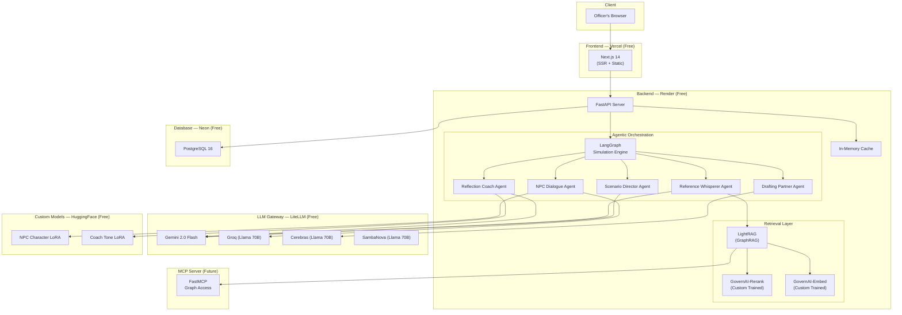

# GovernAI Studio — AI/ML Backend Engine Plan
## v3.0 · May 2026

> **Design Principle:** Zero-cost. If the best tool doesn't exist free, we train it ourselves.
> **Upgrade from v2.0:** ChromaDB → GraphRAG via LightRAG. Single LLM → Multi-provider stacking. Static prompts → Agentic orchestration.

---

## 1. The Core Upgrade: GraphRAG for the Reference Whisperer

### Why GraphRAG Over Plain Vector Search

The v2.0 architecture uses ChromaDB with flat vector search. This works for single-clause retrieval but **fails** at the multi-hop reasoning GovernAI Studio actually needs:

| Query Type | Vector Search (v2.0) | GraphRAG (v3.0) |
|---|---|---|
| "What does Section 8 of DPDP say?" | ✅ Direct match | ✅ Direct match |
| "If I use Aadhaar for AI verification, which acts conflict?" | ❌ Returns fragments | ✅ Traverses Aadhaar Act → DPDP → IT Act edges |
| "What procurement rules apply when the vendor is foreign AND the data is health-related?" | ❌ No cross-doc reasoning | ✅ Walks GFR → DPDP health provisions → ICMR guidelines |
| "How do the Seven Sutras relate to RBI's FREE-AI principles?" | ❌ Keyword overlap only | ✅ Maps conceptual relationships across frameworks |

**GovernAI's legal corpus is inherently a graph** — statutes reference other statutes, guidelines cite principles, frameworks cross-reference each other. A knowledge graph captures this natively.

### Implementation: LightRAG (Free, Open Source, MIT License)

**Why LightRAG over Microsoft GraphRAG:**
- 10x cheaper indexing (fewer LLM calls during graph construction)
- Dual-level retrieval (low-level factual + high-level thematic) — perfect for "which clause" AND "which principle"
- Incremental updates — add new MeitY circulars without rebuilding the entire graph
- Works with any LLM backend (Gemini, Groq, local Ollama)

```
pip install lightrag-hku
```

### Graph Construction Pipeline

```python
# corpus/graph_builder.py
from lightrag import LightRAG, QueryParam
from lightrag.llm import gemini_complete, gemini_embedding

class GovernAIGraphRAG:
    def __init__(self):
        self.rag = LightRAG(
            working_dir="./graph_data",
            llm_model_func=gemini_complete,        # Free Gemini API
            embedding_func=gemini_embedding,        # Free Gemini embeddings
            chunk_token_size=300,
            chunk_overlap_token_size=50,
            entity_extract_max_gleaning=2,          # Balance quality vs API cost
        )
    
    async def ingest_corpus(self, documents: list[dict]):
        """Ingest all 53+ legal/governance documents"""
        for doc in documents:
            text = f"[SOURCE: {doc['title']}] [SECTION: {doc['section']}]\n{doc['content']}"
            await self.rag.ainsert(text)
    
    async def query_references(self, scenario_context: str, 
                                decision_prompt: str,
                                mode: str = "hybrid") -> dict:
        """
        Modes:
        - 'naive'  : Simple vector search (fast, single-hop)
        - 'local'  : Entity-focused graph search (specific clauses)
        - 'global' : Community-level thematic search (principles, sutras)
        - 'hybrid' : Both local + global (default for Whisperer)
        """
        query = f"Context: {scenario_context}\nQuestion: {decision_prompt}"
        result = await self.rag.aquery(
            query, 
            param=QueryParam(mode=mode, top_k=5)
        )
        return result
```

### Knowledge Graph Schema (Auto-Extracted)

LightRAG automatically extracts entities and relationships. For GovernAI's corpus, the graph will contain:

```
ENTITIES (auto-extracted examples):
├── Statute: "DPDP Act 2023", "IT Act 2000", "Aadhaar Act 2016"
├── Section: "Section 8(1)", "Rule 144 GFR", "Section 4 RTI Act"
├── Principle: "Trust is the Foundation", "People First", "Fairness and Equity"
├── Institution: "AIGG", "TPEC", "AISI", "MeitY", "RBI", "SEBI"
├── Domain: "Healthcare", "Agriculture", "Education", "Smart Cities"
├── Risk: "Algorithmic Bias", "Vendor Lock-in", "Data Leakage"
└── Concept: "Data Residency", "Consent", "Explainability", "Due Diligence"

RELATIONSHIPS (auto-extracted examples):
├── DPDP Act 2023 --[DEFINES]--> "Data Fiduciary"
├── Section 8(1) --[PART_OF]--> DPDP Act 2023
├── GFR Rule 144 --[GOVERNS]--> "AI Procurement"
├── "Trust" Sutra --[MAPS_TO]--> RBI FREE-AI Principle 1
├── ICMR Guidelines --[REFERENCES]--> DPDP Act 2023
├── "Algorithmic Bias" --[RISK_IN]--> "Welfare Scoring"
└── AISI --[MANDATED_BY]--> India AI Governance Guidelines
```

### Whisperer v3.0: Graph-Augmented Reference Surfacing

```python
# simulation/reference_whisperer_v3.py
class ReferenceWhispererV3:
    def __init__(self, graph_rag: GovernAIGraphRAG, gemini: GeminiClient):
        self.graph = graph_rag
        self.gemini = gemini
    
    async def surface_references(self, session_context: dict) -> list[dict]:
        # Step 1: Graph query (hybrid mode — local + global)
        raw_results = await self.graph.query_references(
            scenario_context=session_context["scenario_summary"],
            decision_prompt=session_context["current_decision"]["prompt"],
            mode="hybrid"
        )
        
        # Step 2: Gemini rerank + format for officer
        rerank_prompt = f"""You are the Reference Whisperer for GovernAI Studio.
        
Given these retrieved legal/governance references:
{raw_results}

And this decision context:
{session_context["current_decision"]["prompt"]}

Select the 3-5 most relevant references. For each:
1. Quote the exact clause/section
2. Explain in 1 sentence why it's relevant to THIS decision
3. Rate relevance (high/medium)

CRITICAL: Never fabricate clauses. If unsure, say "verify original source."
Format as JSON array."""
        
        formatted = await self.gemini.generate(
            system_prompt="You are a sharp legal research assistant.",
            user_prompt=rerank_prompt,
            temperature=0.2  # Low temp for factual accuracy
        )
        return formatted
```

---

## 2. Multi-Provider LLM Stacking (Zero-Cost Scaling)

### The Problem with Single-Provider (v2.0)

v2.0 relies solely on Gemini free tier (15 RPM). This bottlenecks at 2 concurrent officers.

### The Solution: Provider Stacking via LiteLLM

```python
# ai/llm_gateway.py
import litellm

class LLMGateway:
    """Routes requests across free LLM providers with auto-failover."""
    
    PROVIDER_STACK = [
        {
            "name": "gemini",
            "model": "gemini/gemini-2.0-flash",
            "rpm_limit": 15,
            "daily_limit": 1500,
            "priority": 1,  # Primary
        },
        {
            "name": "groq",
            "model": "groq/llama-3.3-70b-versatile",
            "rpm_limit": 30,
            "daily_limit": 14400,
            "priority": 2,  # Failover 1 — ultra-fast inference
        },
        {
            "name": "cerebras",
            "model": "cerebras/llama-3.3-70b",
            "rpm_limit": 30,
            "daily_limit": 14400,
            "priority": 3,  # Failover 2
        },
        {
            "name": "sambanova",
            "model": "sambanova/Meta-Llama-3.3-70B-Instruct",
            "rpm_limit": 20,
            "daily_limit": 10000,
            "priority": 4,  # Failover 3
        },
    ]
    
    async def generate(self, system_prompt: str, user_prompt: str,
                       temperature: float = 0.5, stream: bool = False,
                       role: str = "general") -> str:
        """Try providers in priority order with auto-failover."""
        for provider in sorted(self.PROVIDER_STACK, key=lambda p: p["priority"]):
            if not self._has_budget(provider):
                continue
            try:
                response = await litellm.acompletion(
                    model=provider["model"],
                    messages=[
                        {"role": "system", "content": system_prompt},
                        {"role": "user", "content": user_prompt}
                    ],
                    temperature=temperature,
                    stream=stream,
                    timeout=30,
                )
                self._record_usage(provider)
                return response
            except Exception:
                continue  # Try next provider
        
        raise LLMBusyError("All providers exhausted. Retry in 60s.")
```

### Effective Free Capacity After Stacking

| Metric | v2.0 (Gemini only) | v3.0 (Stacked) |
|---|---|---|
| RPM (total) | 15 | ~95 |
| Daily requests | 1,500 | ~40,000+ |
| Concurrent officers | ~2 | ~15-20 |
| Provider redundancy | None | 4 providers |

---

## 3. Agentic Orchestration Engine (LangGraph)

### Why Agentic Over Hardcoded Pipelines

v2.0 uses a linear state machine. v3.0 upgrades the five AI roles into **coordinated agents** using LangGraph:

```python
# orchestration/simulation_graph.py
from langgraph.graph import StateGraph, END
from typing import TypedDict

class SimulationState(TypedDict):
    session_id: str
    officer_tier: str
    scenario: dict
    current_stage: str
    npc_context: list[dict]
    decisions_made: list[dict]
    references_surfaced: list[dict]
    reflection_data: dict
    whisperer_triggered: bool

def build_simulation_graph() -> StateGraph:
    graph = StateGraph(SimulationState)
    
    # Define agent nodes
    graph.add_node("scenario_director", scenario_director_agent)
    graph.add_node("stakeholder_router", stakeholder_router_agent)
    graph.add_node("npc_dialogue", npc_dialogue_agent)
    graph.add_node("reference_whisperer", reference_whisperer_agent)
    graph.add_node("decision_handler", decision_handler_agent)
    graph.add_node("drafting_partner", drafting_partner_agent)
    graph.add_node("consequence_engine", consequence_engine_agent)
    graph.add_node("reflection_coach", reflection_coach_agent)
    
    # Define edges (the orchestration logic)
    graph.set_entry_point("scenario_director")
    graph.add_edge("scenario_director", "stakeholder_router")
    
    graph.add_conditional_edges("stakeholder_router", route_npc_or_decision, {
        "npc": "npc_dialogue",
        "decision": "decision_handler",
    })
    
    graph.add_conditional_edges("npc_dialogue", check_npc_complete, {
        "continue": "stakeholder_router",
        "all_done": "decision_handler",
    })
    
    graph.add_conditional_edges("decision_handler", check_whisperer, {
        "whisperer": "reference_whisperer",
        "draft": "drafting_partner",
        "next_decision": "decision_handler",
        "consequences": "consequence_engine",
    })
    
    graph.add_edge("reference_whisperer", "decision_handler")
    graph.add_edge("drafting_partner", "decision_handler")
    graph.add_edge("consequence_engine", "reflection_coach")
    graph.add_edge("reflection_coach", END)
    
    return graph.compile()
```

### What This Enables (That v2.0 Cannot Do)

| Capability | v2.0 | v3.0 (Agentic) |
|---|---|---|
| NPC reacts to officer's decision mid-scenario | ❌ Linear | ✅ Dynamic routing |
| Whisperer triggers proactively (not just on-demand) | ❌ Manual only | ✅ Context-aware trigger |
| Drafting Partner cites specific graph references | ❌ Generic critique | ✅ Graph-grounded critique |
| Reflection Coach sees full decision + reference trail | ❌ Partial context | ✅ Full state passed through |
| Checkpoint/resume mid-graph | ❌ Manual DB writes | ✅ LangGraph persistence |

---

## 4. Custom Training Strategy

### When We Train (Decision Matrix)

| Component | Best Free Option Available? | Train Our Own? |
|---|---|---|
| General LLM (NPC/Coach/Director) | ✅ Gemini/Llama 70B free | No — use as-is |
| Embeddings (corpus search) | ⚠️ Generic models miss legal nuance | **YES — fine-tune** |
| NPC Character Consistency | ⚠️ Breaks character on long conversations | **YES — LoRA adapter** |
| Reflection Coach Tone | ⚠️ Sounds evaluative despite prompts | **YES — LoRA adapter** |
| Indian Legal Reranker | ❌ Nothing exists for Indian legal corpus | **YES — train from scratch** |

### 4.1 Custom Embedding Model: "GovernAI-Embed"

**Base Model:** Vyakyarth (Krutrim AI Labs) — purpose-built for Indian languages
**Alternative Base:** BGE-M3 or Qwen3-Embedding-0.6B
**Training Method:** Contrastive learning with Matryoshka Representation Learning (MRL)

**Training Data (curated from our corpus):**
```
Positive pairs (clause → related clause):
  ("Section 8(1) DPDP", "Rule 144 GFR procurement")  → related
  ("Sutra: Trust", "RBI FREE-AI Principle 1")         → related

Hard negatives (similar text, different meaning):
  ("Section 8(1) DPDP data fiduciary", "Section 8 IT Act intermediary") → NOT related
```

**Where to Train (Free):**
- Kaggle Notebooks: 30 hrs/week GPU (T4), sufficient for embedding fine-tune
- Google Colab free tier: backup option
- Estimated training time: ~2-4 hours on T4

### 4.2 NPC Character LoRA: "GovernAI-NPC-Adapter"

**Problem:** Base LLMs break character after 10+ exchanges. A vendor NPC starts giving meta-commentary. A journalist NPC becomes helpful instead of adversarial.

**Solution:** Train a QLoRA adapter on synthetic NPC dialogue data.

**Base Model:** Llama 3.3 8B (or Qwen 2.5 7B)
**Method:** QLoRA 4-bit via Unsloth
**Training Data:** 500-1000 synthetic multi-turn conversations per NPC archetype

```python
# training/npc_lora_training.py (Kaggle/Colab notebook)
from unsloth import FastLanguageModel

model, tokenizer = FastLanguageModel.from_pretrained(
    model_name="unsloth/llama-3.3-8b-instruct-bnb-4bit",
    max_seq_length=4096,
    load_in_4bit=True,
)

model = FastLanguageModel.get_peft_model(
    model,
    r=32,           # LoRA rank
    lora_alpha=64,
    target_modules=["q_proj", "k_proj", "v_proj", "o_proj"],
    lora_dropout=0.05,
)

# Training data format:
# {"conversations": [
#   {"role": "system", "content": "You are Vikram Desai, vendor solution architect..."},
#   {"role": "user", "content": "What data residency guarantees do you provide?"},
#   {"role": "assistant", "content": "Excellent question. Our cloud..."}
# ]}
```

**Where to Train:** Kaggle Notebooks (T4 GPU, ~3-5 hours for 1000 samples)

### 4.3 Reflection Coach LoRA: "GovernAI-Coach-Adapter"

**Problem:** LLMs default to evaluative language ("You did well on...", "You should have..."). The Reflection Coach must ONLY use reflective questions and observations.

**Solution:** Fine-tune a LoRA adapter on curated reflection transcripts.

**Training Data:** 200-300 synthetic reflection sessions following strict rules:
- Never score, rank, or compare
- Always use reflective questions ("How might...", "What if...")
- Always ground in specific Sutras
- Always surface alternative approaches without judgement

### 4.4 Indian Legal Reranker: "GovernAI-Rerank"

**Problem:** No existing reranker understands Indian legal cross-references.
**Base Model:** BGE-reranker-v2-m3 (small, efficient)
**Training Data:** 5,000 (query, passage, relevance_score) triplets from our corpus
**Where to Train:** Kaggle, ~2 hours on T4

---

## 5. Embedding & Retrieval Architecture (Hybrid)

### The Hybrid Pipeline

```
Officer's Decision Context
          │
          ▼
┌─────────────────────┐
│  Query Classifier    │  ← Classifies: simple/complex/thematic
│  (rule-based, fast)  │
└─────────────────────┘
          │
    ┌─────┴─────┐
    ▼           ▼
┌────────┐  ┌──────────┐
│ Vector │  │ GraphRAG │
│ Search │  │ Traversal│
│(simple)│  │(complex) │
└────────┘  └──────────┘
    │           │
    └─────┬─────┘
          ▼
┌─────────────────────┐
│  GovernAI-Rerank     │  ← Custom-trained reranker
│  (Indian legal)      │
└─────────────────────┘
          │
          ▼
┌─────────────────────┐
│  Gemini Format +     │  ← Formats for officer readability
│  Citation Generator  │
└─────────────────────┘
          │
          ▼
    Reference Sidebar
```

---

## 6. MCP Integration (Future-Proofing)

### What MCP Gives Us

The Model Context Protocol makes the knowledge graph accessible to ANY future AI agent or tool:

```python
# mcp/graph_server.py
from fastmcp import FastMCP

mcp = FastMCP("GovernAI Knowledge Graph")

@mcp.tool()
async def query_legal_corpus(query: str, mode: str = "hybrid") -> str:
    """Search the Indian AI governance legal corpus.
    Modes: naive (vector), local (entity), global (thematic), hybrid (both)."""
    result = await graph_rag.query_references(
        scenario_context="", decision_prompt=query, mode=mode
    )
    return result

@mcp.tool()
async def get_entity_relationships(entity_name: str) -> str:
    """Get all relationships for a legal entity (statute, section, institution)."""
    return await graph_rag.get_entity_graph(entity_name)

@mcp.tool()
async def trace_cross_references(source_doc: str, target_doc: str) -> str:
    """Trace how two documents are connected via cross-references."""
    return await graph_rag.trace_path(source_doc, target_doc)
```

**Why this matters:** Any future tool — a Reflection Coach running on Claude, a scenario authoring assistant, a research agent — can plug into our knowledge graph via MCP without custom integration code.

---

## 7. Updated Free-Tier Stack (v3.0)

| Layer | v2.0 | v3.0 | Cost |
|---|---|---|---|
| **RAG Engine** | ChromaDB (vector only) | LightRAG (GraphRAG + vector hybrid) | Free (MIT) |
| **LLM** | Gemini only (15 RPM) | Gemini + Groq + Cerebras + SambaNova (stacked) | Free |
| **Embeddings** | Gemini or MiniLM | GovernAI-Embed (custom fine-tuned) + Gemini fallback | Free |
| **Reranker** | None | GovernAI-Rerank (custom trained) | Free |
| **Orchestration** | Hardcoded state machine | LangGraph (agentic, stateful) | Free (MIT) |
| **LLM Gateway** | Direct API calls | LiteLLM (unified interface, auto-failover) | Free (MIT) |
| **NPC Quality** | Prompt engineering only | GovernAI-NPC-Adapter (QLoRA) + prompts | Free (train on Kaggle) |
| **Coach Quality** | Prompt engineering only | GovernAI-Coach-Adapter (QLoRA) + prompts | Free (train on Kaggle) |
| **MCP Server** | N/A | FastMCP (future-proofing) | Free |
| **Graph Storage** | N/A | LightRAG file-based (on Render disk) | Free |
| **TOTAL** | | | **₹0/month** |

---

## 8. Training Infrastructure (All Free)

| Resource | What We Get | What We Train On It |
|---|---|---|
| **Kaggle Notebooks** | 30 hrs/week T4 GPU, 16GB VRAM | Embedding fine-tune, LoRA adapters, reranker |
| **Google Colab** | ~4 hrs/day T4 (variable) | Backup training, experimentation |
| **Hugging Face** | Model hosting (free for public models) | Host trained adapters |
| **Unsloth** | 2x faster LoRA training | NPC + Coach adapters |
| **Weights & Biases** | Free tier experiment tracking | Track training runs |

### Training Timeline

| Model | Data Needed | Prep Time | Train Time | Total |
|---|---|---|---|---|
| GovernAI-Embed | ~10K pairs from corpus | 1 week | 4 hours | Week 2-3 |
| GovernAI-Rerank | ~5K triplets from corpus | 1 week | 2 hours | Week 3-4 |
| GovernAI-NPC-Adapter | ~5K synthetic conversations | 2 weeks | 5 hours | Week 4-6 |
| GovernAI-Coach-Adapter | ~500 reflection transcripts | 1 week | 3 hours | Week 5-6 |

---

## 9. Architecture Diagram (v3.0)



---

## 10. Risk Mitigations (New in v3.0)

| Risk | Mitigation |
|---|---|
| LightRAG graph construction uses too many LLM calls | Use `entity_extract_max_gleaning=2` (not default 5). Batch during off-peak. One-time cost. |
| Custom LoRA models drift from base quality | Evaluate against golden test sets before deployment. Keep base model as fallback. |
| LiteLLM failover adds latency | Primary provider (Gemini) handles 80% of requests. Failover only on rate limit. <2s added. |
| LangGraph adds complexity vs. simple state machine | Keep v2.0 state machine as fallback. LangGraph wraps the same logic with better state management. |
| Kaggle/Colab training GPUs become unavailable | All models are small (< 8B params). Can train on any T4/RTX 3060. HF free credits as backup. |

---

*End of AI/ML Backend Engine Plan v3.0*
